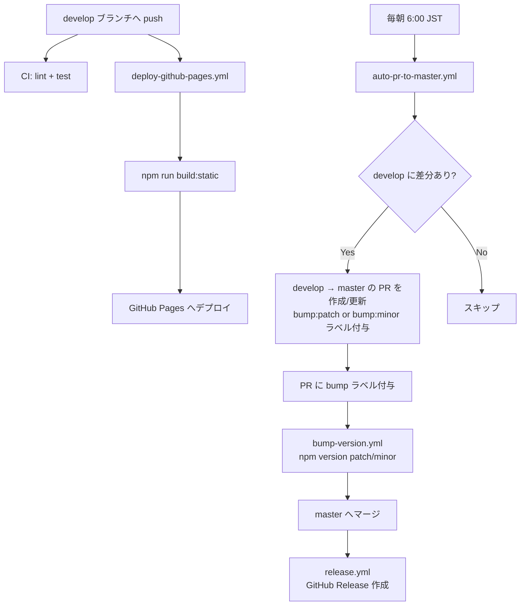

# infra.md

## 構成図

## 環境一覧

| 環境 | ブランチ | 用途 |
|------|---------|------|
| 開発 | `develop` | 機能開発・デプロイ元 |
| 本番 | `master` | リリース管理・バージョンタグ |
| GitHub Pages | — | `develop` push 時に自動デプロイ |

## ワークフロー一覧

| ファイル | トリガー | 役割 |
|---------|---------|------|
| `ci.yml` | `develop` / `master` への PR | lint + テスト |
| `deploy-github-pages.yml` | `develop` への push / 手動 | GitHub Pages へ静的サイトをデプロイ |
| `auto-pr-to-master.yml` | 毎朝 6:00 JST / 手動 | `develop → master` の PR を自動作成・更新 |
| `bump-version.yml` | `master` への PR に `bump:*` ラベル付与 | `package.json` バージョンを自動バンプ |
| `release.yml` | `master` への push | GitHub Release を自動作成 |

## デプロイ手順

### 自動デプロイ（通常運用）

`develop` ブランチに push するだけで GitHub Pages へ自動デプロイされる。

### 手動トリガー

GitHub Actions の画面から `deploy-github-pages.yml` を手動実行できる:
1. Actions タブ →「Deploy to GitHub Pages」→「Run workflow」

## リリースフロー

1. `develop` で開発・PR マージを繰り返す
2. 毎朝 6:00 に `auto-pr-to-master.yml` が差分を検出し PR を自動作成
3. PR に `bump:minor`（新機能）または `bump:patch`（修正）ラベルが付く
4. PR をマージすると `bump-version.yml` が `package.json` バージョンをバンプ
5. `master` への push で `release.yml` が GitHub Release を自動作成

## 必要なシークレット

| シークレット名 | 用途 | 登録場所 |
|--------------|------|---------|
| `AUTO_PR_TOKEN` | `auto-pr-to-master.yml` で PR 作成に使用する PAT | Settings > Secrets and variables > Actions |
