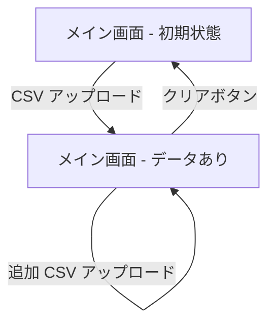

# ui.md

## 画面一覧

| 画面名 | パス | 概要 |
|--------|------|------|
| メイン画面 | `/` | アプリ唯一の画面。アップロード・フィルタリング・チャートを 1 ページに集約 |

## 画面遷移図

## 機能仕様

画面は上から順に、ヘッダー → アップロードパネル → 集計サマリ（集計モード切替・時間軸切替・合計金額・3 つのフィルター・積み上げ棒グラフ）で構成する。

### CSV インポート

| 項目 | 契約 |
|------|------|
| ファイル名形式 | `monthly-report-YYYY-MM-ACCOUNTID.csv`。年月（YYYY-MM）と AWS アカウント ID をファイル名から自動抽出する |
| 複数アップロード | ドラッグ＆ドロップまたはファイル選択で複数ファイルを同時に取り込める |
| 上書き更新 | 同一アカウント・同一月のファイルを再アップロードすると上書き更新する（重複させない） |
| 必須カラム | `product_name`、`cost`（`$` や `,` を含む文字列も正規化して数値変換する） |
| カラム欠損時 | 警告を表示し、そのファイルのデータは取り込まない |
| エラー・警告表示 | パースエラーは画面上に表示。警告は最大 5 件まで表示する |

### フィルタリング

- アカウント・年月・サービスをチェックボックスで絞り込む
- 各フィルターにテキスト検索欄を持つ
- 各フィルターに全選択・全解除ボタンを持つ
- サービスフィルターはコスト上位を一括選択する「Top10」ボタンを持つ

### 集計・チャート表示

- フィルター条件に応じた積み上げ棒グラフをリアルタイムで更新する
- 集計モードを「サービス別」「アカウント別」で切り替えられる
- 時間軸を「月次」「年次」で切り替えられる
- 選択条件の合計金額を USD でリアルタイム表示する

### データ管理

- 「クリア」ボタンで全読み込みデータ・エラー・警告を初期化する
- 追加アップロードで既存データに差分追加する

## 各画面の表示状態

| 状態 | 表示内容 |
|------|---------|
| **初期（Empty）** | アップロードパネルのみ表示。チャートエリアに「まずは CSV ファイルをアップロードしてください。」と表示 |
| **パース中（Loading）** | アップロードパネルがローディング状態になる |
| **データあり（Normal）** | 全フィルター・チャートが有効化される |
| **エラー（Error）** | アップロードパネル内にエラーメッセージを表示 |
| **警告あり（Warning）** | アップロードパネル内に最大 5 件の警告を表示 |
| **フィルターで全解除** | チャートエリアに空グラフが表示される（データなし状態） |

## UI 規約

| 項目 | 規約 |
|------|------|
| カラーテーマ | `slate-950` をベース背景、`slate-900` をカード背景とするダークテーマ |
| フォント | Geist（`next/font` 経由） |
| 角丸 | カード・パネルは `rounded-2xl`、内部要素は `rounded-xl` |
| ボーダー | `border-slate-800` で統一 |
| テキスト | 基本 `text-slate-100`、補足 `text-slate-300`、ヒント `text-slate-400` |
| インタラクション | ホバー時に `bg-slate-800` でハイライト |

> 画面を構成するコンポーネントの一覧・Props は `src/components/` および `src/app/page.tsx` を正とする。
