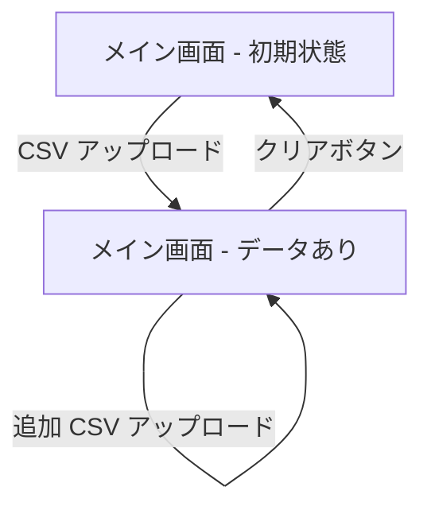

# ui.md

## 画面一覧

| 画面名 | パス | 概要 |
|--------|------|------|
| メイン画面 | `/` | アプリ唯一の画面。アップロード・フィルタリング・チャートを 1 ページに集約 |

## 画面遷移図



## 画面機能仕様

### メイン画面

#### アップロードパネル（UploadPanel）

| 操作 | 挙動 |
|------|------|
| ファイルをドラッグ＆ドロップ | CSV をパースしてデータを追加 |
| 「ファイルを選択」クリック | ファイル選択ダイアログを開く |
| 同一アカウント・同一月のファイルを再アップロード | 既存データを上書き更新 |
| 「クリア」クリック | 全データ・エラー・警告を初期化 |

#### 集計サマリセクション

| 要素 | 説明 |
|------|------|
| 集計モード切替（ラジオボタン） | 「サービス別」「アカウント別」を切り替え |
| 時間軸切替（ラジオボタン） | 「月次」「年次」を切り替え |
| 合計金額 | 現在の選択条件に応じた USD 合計をリアルタイム表示 |
| アカウントフィルター | チェックボックス・テキスト検索・全選択・全解除 |
| 年月フィルター | チェックボックス・テキスト検索・全選択・全解除 |
| サービスフィルター | チェックボックス・テキスト検索・全選択・Top10・全解除 |
| 積み上げ棒グラフ | 選択条件を反映した Chart.js グラフ |

## 各画面の表示状態

### メイン画面

| 状態 | 表示内容 |
|------|---------|
| **初期（Empty）** | アップロードパネルのみ表示。チャートエリアに「まずは CSV ファイルをアップロードしてください。」と表示 |
| **パース中（Loading）** | アップロードパネルがローディング状態になる |
| **データあり（Normal）** | 全フィルター・チャートが有効化される |
| **エラー（Error）** | アップロードパネル内にエラーメッセージを表示 |
| **警告あり（Warning）** | アップロードパネル内に最大 5 件の警告を表示 |
| **フィルターで全解除** | チャートエリアに空グラフが表示される（データなし状態） |

## レイアウト構成

```
<div> min-h-screen bg-slate-950
  <div> max-w-7xl mx-auto px-4 pt-16
    <header>          # タイトル・説明文
    <UploadPanel>     # アップロードエリア・エラー・警告
    <section>         # 集計サマリ
      集計モード切替
      時間軸切替
      合計金額カード
      <div> grid-cols-3
        <AccountSelector>
        <MonthSelector>
        <ServiceSelector>
      <StackedBarChart>
```

## コンポーネント一覧

| コンポーネント | ファイル | 役割 | 主な Props |
|--------------|---------|------|-----------|
| `UploadPanel` | `src/components/UploadPanel.tsx` | ファイルアップロード UI・エラー・警告表示 | `onFileChange`, `onDrop`, `isDragActive`, `isParsing`, `errorMessage`, `warnings` |
| `AccountSelector` | `src/components/AccountSelector.tsx` | アカウントフィルター | `filteredAccounts`, `selectedAccounts`, `toggleAccount`, `selectAllAccounts`, `clearSelectedAccounts`, `accountFilter`, `setAccountFilter` |
| `MonthSelector` | `src/components/MonthSelector.tsx` | 年月フィルター | `filteredMonths`, `selectedMonths`, `toggleMonth`, `selectAllMonths`, `clearSelectedMonths`, `monthFilter`, `setMonthFilter` |
| `ServiceSelector` | `src/components/ServiceSelector.tsx` | サービスフィルター・Top10 | `filteredServices`, `selectedServices`, `toggleService`, `selectAllServices`, `selectTop10`, `clearSelectedServices`, `serviceFilter`, `setServiceFilter` |
| `StackedBarChart` | `src/components/StackedBarChart.tsx` | Chart.js 積み上げ棒グラフ・合計値オーバーレイ | `data`, `services`, `onLegendClick`, `showLegend` |

## UI 規約

| 項目 | 規約 |
|------|------|
| カラーテーマ | `slate-950` をベース背景、`slate-900` をカード背景とするダークテーマ |
| フォント | Geist（`next/font` 経由） |
| 角丸 | カード・パネルは `rounded-2xl`、内部要素は `rounded-xl` |
| ボーダー | `border-slate-800` で統一 |
| テキスト | 基本 `text-slate-100`、補足 `text-slate-300`、ヒント `text-slate-400` |
| インタラクション | ホバー時に `bg-slate-800` でハイライト |
